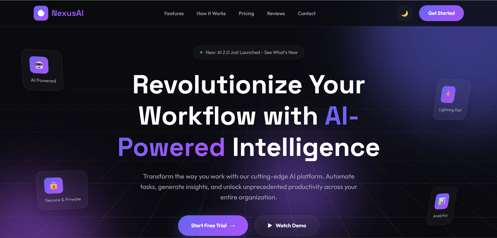

# 🌐 Omkar R. Ghare — AI SaaS Startup Landing Page Template

A modern and responsive **AI SaaS startup landing page template** built to showcase futuristic UI design, product-focused layout, and advanced front-end development skills.

This project demonstrates my ability to design conversion-oriented SaaS interfaces with smooth animations, structured sections, and professional UI/UX presentation using core web technologies.

---

## 🚀 Live Demo  
🔗 https://github.com/Omkarghare8/ai-saas-startup-landing-page-template

---

## ✨ Features

- Modern AI-inspired UI design  
- Fully responsive on mobile, tablet, and desktop  
- Clean and conversion-focused layout  
- Smooth animations and hover effects  
- Hero section with strong CTA  
- Product features showcase  
- Pricing section  
- Testimonials section  
- FAQ section  
- Contact section  
- Professional footer design  

---

## 🛠 Tech Stack

- **HTML5** – Structure  
- **CSS3** – Styling and layout  
- **JavaScript** – Interactivity  
- Responsive design techniques  
- Modern UI/UX principles  

---

## 📂 Project Structure
ai-saas-startup-landing-page-template/
│
├── index.html
├── preview.png
├── LICENSE
└── README.md

---

## 📸 Preview

(Add a screenshot of the homepage and name it **preview.png**)

---

## 🎯 Purpose of This Project

This project is part of my **front-end development journey**, created to demonstrate my ability to:

- Build professional SaaS landing pages  
- Design modern AI-focused interfaces  
- Structure scalable front-end projects  
- Create startup-ready website templates  
- Implement responsive and clean UI layouts  

---

## 👨‍💻 Author

**Omkar R. Ghare**  
Front-End Developer  
Passionate about building modern, interactive, and AI-powered web experiences.

---

## 📌 Note

This project is created for portfolio showcasing, learning purposes, and internship/job opportunities in Web Development.
